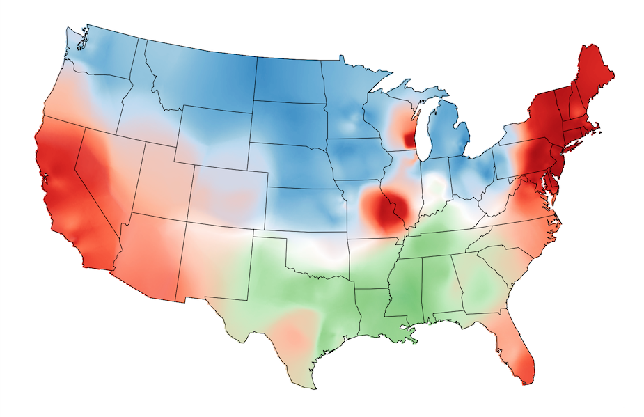

```{r setup, include=FALSE}
knitr::opts_chunk$set(echo = TRUE)
```

\newpage

# Introduction

Petit rappel:  
En analyse numérique, l'interpolation spatiale désigne l'interpolation numérique de fonctions de plus d'une variable.  
L'interpolation spatiale est notamment utilisée en géostatistique, où elle est utilisée pour reconstruire les valeurs d'une variable régionalisée sur un domaine à partir d'échantillons connus en un nombre limité de points. Par exemple en météorologie, il s'agit de l'estimation de valeurs intermédiaires inconnues à partir de valeurs discrètes connues d'une variable dépendante, comme la température, sur une carte météorologique1.   
Ce document vous présentera quelques exemples d'implémentations de différents méthodes d'interpolation spatiale en langage R.

Avant de commencer, il est nécessaire d'installer les packages suivants:

+ rgdal
+ tmap
+ spatstat
+ maptools
+ raster
+ gstat
+ sp  

{width=100%}
\newpage

# Interpolation en R

```{r, warning=FALSE, message=FALSE, results='hide'}
library(rgdal)
library(tmap)

z <- gzcon(url("http://colby.edu/~mgimond/Spatial/Data/precip.rds"))
P <- readRDS(z)

z <- gzcon(url("http://colby.edu/~mgimond/Spatial/Data/texas.rds"))
W <- readRDS(z)

P@bbox <- W@bbox

tm_shape(W) + tm_polygons() +
  tm_shape(P) +
  tm_dots(col="Precip_in", palette = "RdBu", auto.palette.mapping = FALSE,
             title="Sampled precipitation \n(in inches)", size=0.7) +
  tm_text("Precip_in", just="left", xmod=.5, size = 0.7) +
  tm_legend(legend.outside=TRUE)
```  

On charge ici les données de précipitations ainsi que la carte de l'état du Texas. Graçe à cela, il est possible de lier les données de précipitations à l'état du Texas en remplaçant les points avec "P@bbox <- W@bbox".

\newpage

# Polygone de Thiessen

```{r, warning=FALSE, message=FALSE, results='hide'}
library(spatstat)  
library(maptools)  
library(raster)

th  <-  as(dirichlet(as.ppp(P)), "SpatialPolygons")

proj4string(th) <- proj4string(P)


th.z     <- over(th, P, fn=mean)
th.spdf  <-  SpatialPolygonsDataFrame(th, th.z)

th.clp   <- raster::intersect(W,th.spdf)

tm_shape(th.clp) + 
  tm_polygons(col="Precip_in", palette="RdBu", auto.palette.mapping=FALSE,
              title="Predicted precipitation \n(in inches)") +
  tm_legend(legend.outside=TRUE)
```  

Le Polygone de Thiessen est crée à partir de la fonction "dirichlet" du package spatstat.

\newpage

# IDW (Pondération inverse à la distance)

```{r, warning=FALSE, message=FALSE, results='hide'}
library(gstat) 
library(sp)

grd              <- as.data.frame(spsample(P, "regular", n=50000))
names(grd)       <- c("X", "Y")
coordinates(grd) <- c("X", "Y")
gridded(grd)     <- TRUE  
fullgrid(grd)    <- TRUE

proj4string(P) <- proj4string(P) 
proj4string(grd) <- proj4string(P)

P.idw <- gstat::idw(Precip_in ~ 1, P, newdata=grd, idp=2.0)

r       <- raster(P.idw)
r.m     <- mask(r, W)

tm_shape(r.m) + 
  tm_raster(n=10,palette = "RdBu", auto.palette.mapping = FALSE,
            title="Predicted precipitation \n(in inches)") + 
  tm_shape(P) + tm_dots(size=0.2) +
  tm_legend(legend.outside=TRUE)
```  

La sortie IDW est un raster. Pour cela, nous devons d'abord créer une grille raster vide, puis interpoler les valeurs de précipitations dans chaque cellule de grille non échantillonnée. Une valeur de puissance IDW de 2 (idp = 2.0) sera utilisée.

\newpage

# Kriging

```{r, warning=FALSE, message=FALSE, results='hide'}

P$X <- coordinates(P)[,1]
P$Y <- coordinates(P)[,2]

f.1 <- as.formula(Precip_in ~ X + Y) 

var.smpl <- variogram(f.1, P, cloud = FALSE, cutoff=1000000, width=89900)

dat.fit  <- fit.variogram(var.smpl, fit.ranges = FALSE, fit.sills = FALSE,
                          vgm(psill=14, model="Sph", range=590000, nugget=0))

plot(var.smpl, dat.fit, xlim=c(0,1000000))
```  

Tout d'abord, nous devons créer un modèle de [**variogramme**](hhttps://fr.wikipedia.org/wiki/Variogramme) Le modèle de variogramme est calculé sur les données dépendantes. Ceci est implémenté dans le morceau de code ci-sessus en passant le modèle de tendance de 1er ordre (dans f.1) à la fonction variogramme.

\newpage

## Generate Kriged surface

On utilise par la suite le modèle de variogramme "dat.fit" pour générer une surface interpolée krigée. La fonction krige nous permet d'inclure le modèle de tendance nous évitant ainsi d'avoir à dé-tendancer les données, puis combiner les deux rasters.  
  
```{r, warning=FALSE, message=FALSE, results='hide'}
f.1 <- as.formula(Precip_in ~ X + Y) 

dat.krg <- krige( f.1, P, grd, dat.fit)

r <- raster(dat.krg)
r.m <- mask(r, W)

tm_shape(r.m) + 
  tm_raster(n=10, palette="RdBu", auto.palette.mapping=FALSE, 
            title="Predicted precipitation \n(in inches)") +
  tm_shape(P) + tm_dots(size=0.2) +
  tm_legend(legend.outside=TRUE)
```

\newpage

## Generate the variance and confidence interval maps

L'objet dat.krg stocke non seulement les valeurs interpolées, mais également les valeurs de variance. Ceux-ci peuvent être transmis à l'objet raster pour le mappage:  
  

```{r, warning=FALSE, message=FALSE, results='hide'}
r   <- raster(dat.krg, layer="var1.var")
r.m <- mask(r, W)

tm_shape(r.m) + 
  tm_raster(n=7, palette ="Reds",
            title="Variance map \n(in squared inches)") +tm_shape(P) + tm_dots(size=0.2) +
  tm_legend(legend.outside=TRUE)
```  


\newpage

Une carte plus facilement interprétable est la carte d'intervalle de confiance à 95% qui peut être générée à partir de l'objet de variance (les valeurs de la carte doivent être interprétées comme le nombre de pouces au-dessus et en dessous de la quantité de pluie estimée).  


```{r, warning=FALSE, message=FALSE, results='hide'}
r   <- sqrt(raster(dat.krg, layer="var1.var")) * 1.96
r.m <- mask(r, W)

tm_shape(r.m) + 
  tm_raster(n=7, palette ="Reds",
            title="95% CI map \n(in inches)") +tm_shape(P) + tm_dots(size=0.2) +
  tm_legend(legend.outside=TRUE)
```


# Bilbliographie

+ https://fr.wikipedia.org/wiki/Interpolation_multivari%C3%A9e
+ https://mgimond.github.io/Spatial/interpolation-in-r.html

